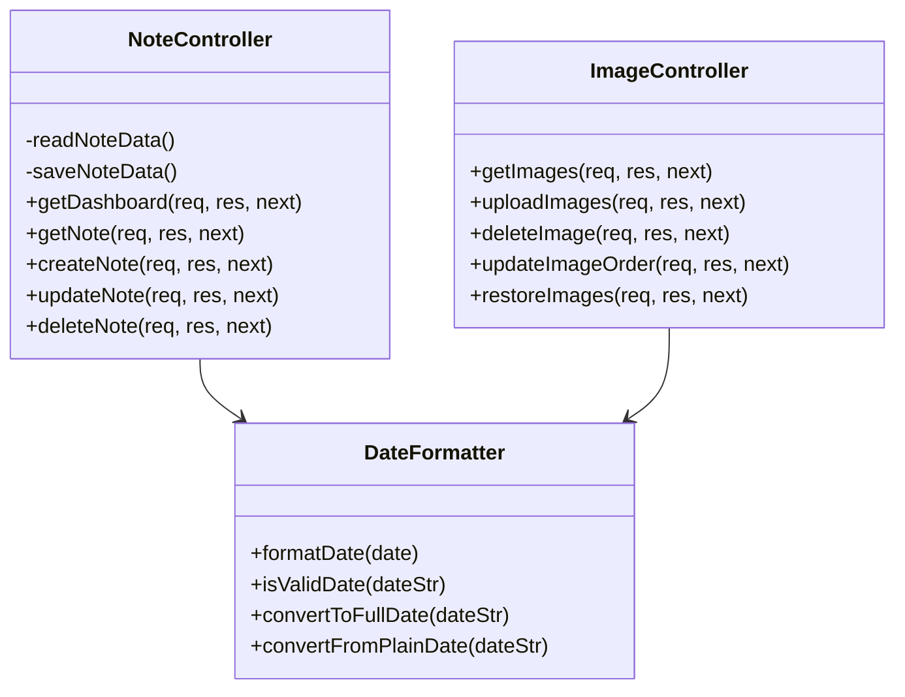
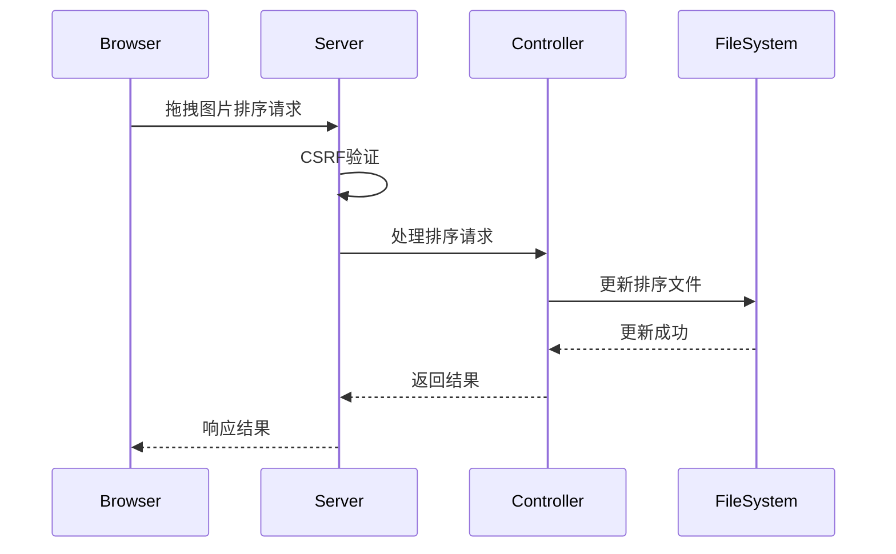
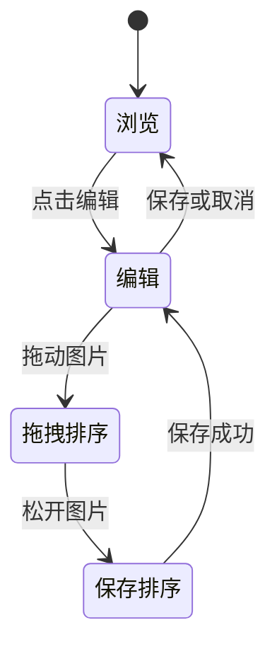

# Math Note Project UML Diagrams

## 类图

```mermaid
classDiagram
    class NoteController {
        -readNoteData()
        -saveNoteData()
        +getDashboard(req, res, next)
        +getNote(req, res, next)
        +createNote(req, res, next)
        +updateNote(req, res, next)
        +deleteNote(req, res, next)
    }

    class ImageController {
        +getImages(req, res, next)
        +uploadImages(req, res, next)
        +deleteImage(req, res, next)
        +updateImageOrder(req, res, next)
        +restoreImages(req, res, next)
    }

    class DateFormatter {
        +formatDate(date)
        +isValidDate(dateStr)
        +convertToFullDate(dateStr)
        +convertFromPlainDate(dateStr)
    }

    NoteController --> DateFormatter
    ImageController --> DateFormatter
```

## 流程图

```mermaid
sequenceDiagram
    participant Browser
    participant Server
    participant Controller
    participant FileSystem

    Browser->>Server: 拖拽图片排序请求
    Server->>Server: CSRF验证
    Server->>Controller: 处理排序请求
    Controller->>FileSystem: 更新排序文件
    FileSystem-->>Controller: 更新成功
    Controller-->>Server: 返回结果
    Server-->>Browser: 响应结果
```

## 状态图

```mermaid
stateDiagram-v2
    [*] --> 浏览
    浏览 --> 编辑: 点击编辑
    编辑 --> 拖拽排序: 拖动图片
    拖拽排序 --> 保存排序: 松开图片
    保存排序 --> 编辑: 保存成功
    编辑 --> 浏览: 保存或取消
```