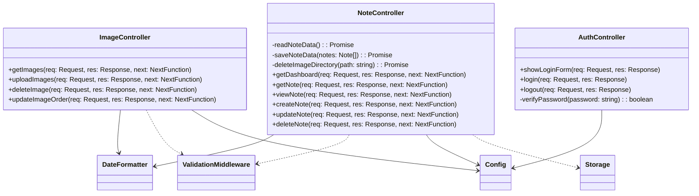
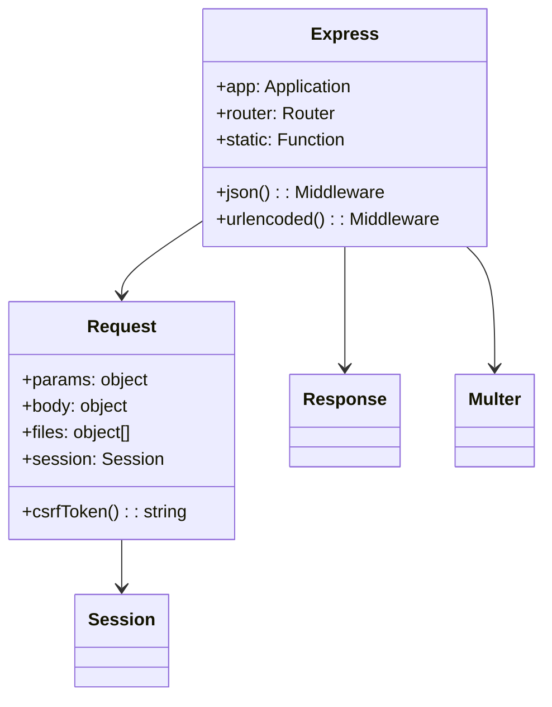
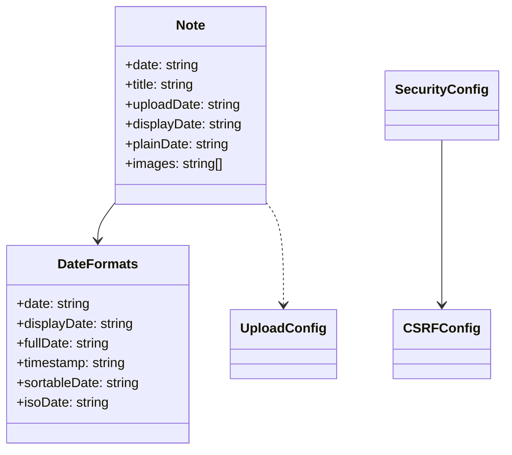

# Math Note Project UML Diagrams

```mermaid
classDiagram
    class NoteController {
        -readNoteData(): Promise<Note[]>
        -saveNoteData(notes: Note[]): Promise<void>
        -deleteImageDirectory(path: string): Promise<void>
        +getDashboard(req: Request, res: Response, next: NextFunction)
        +getNote(req: Request, res: Response, next: NextFunction)
        +viewNote(req: Request, res: Response, next: NextFunction)
        +createNote(req: Request, res: Response, next: NextFunction)
        +updateNote(req: Request, res: Response, next: NextFunction)
        +deleteNote(req: Request, res: Response, next: NextFunction)
    }

    class ImageController {
        +getImages(req: Request, res: Response, next: NextFunction)
        +uploadImages(req: Request, res: Response, next: NextFunction)
        +deleteImage(req: Request, res: Response, next: NextFunction)
        +updateImageOrder(req: Request, res: Response, next: NextFunction)
    }

    class AuthController {
        +showLoginForm(req: Request, res: Response)
        +login(req: Request, res: Response)
        +logout(req: Request, res: Response)
        -verifyPassword(password: string): boolean
    }

    NoteController --> DateFormatter
    ImageController --> DateFormatter
    NoteController ..> ValidationMiddleware
    ImageController ..> ValidationMiddleware
    NoteController --> Config
    ImageController --> Config
    AuthController --> Config
    NoteController ..> Storage
```

```mermaid
classDiagram
    class Express {
        +app: Application
        +router: Router
        +static: Function
        +json(): Middleware
        +urlencoded(): Middleware
    }

    class Request {
        +params: object
        +body: object
        +files: object[]
        +session: Session
        +csrfToken(): string
    }

    Express --> Request
    Express --> Response
    Request --> Session
    Express --> Multer
```

```mermaid
classDiagram
    class Note {
        +date: string
        +title: string
        +uploadDate: string
        +displayDate: string
        +plainDate: string
        +images: string[]
    }

    class DateFormats {
        +date: string
        +displayDate: string
        +fullDate: string
        +timestamp: string
        +sortableDate: string
        +isoDate: string
    }

    Note --> DateFormats
    SecurityConfig --> CSRFConfig
    Note ..> UploadConfig
```